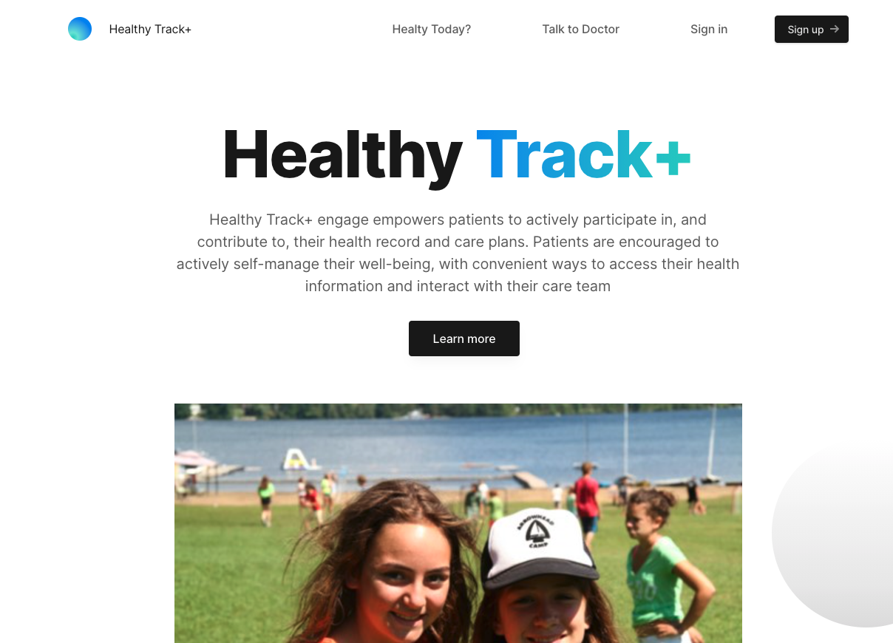

# Healthy Track+App
##Course Project for CS 6998 Cloud Computing at Columbia University 
Healthy Track+ engage empowers patients to actively participate in, and contribute to, their health record and care plans. Patients are encouraged to actively self-manage their well-being, with convenient ways to access their health information and interact with their care team

You can Visit the Application on https://healthy-you-app3-okq4qvpl2-usraptor2016.vercel.app/

